# cpr: An R package for finding parsimonious B-spline regression models via control polygon reduction
Peter E. DeWitt  
28 June 2017  

## Opening Notes:

* Thank you Glavanive for providing the space for our meetup.

* Outline for this talk:

    * Brief overview of Control Polygon Reduction.
    * Overview and qucik example of using the cpr package to find parsimonious
      B-spline regression models.
    * R Programming Examples:

        * `match.fun`
        * `match.call`
        * `update`
        * formulae and environments


# Control Polygon Reduction
<aside class="gdbar">

</aside>

<div class="notes">
$$\newcommand{\bs}[1]{\boldsymbol{#1}}
\newcommand{\card}[1]{n\left(#1\right)}$$
</div>

## Introduction
- Consider the regression model
$$\bs{y} = f \left( \bs{x} \right) + \bs{Z}_{f}
  \bs{\beta} + \bs{Z}_{r} \bs{b} + \bs{\epsilon}$$

- Goals:
    - Model $f$ via uni-variable B-splines.
    - Regression model needs to be parsimonious (low degree of freedom).

- Challenges:
    - B-splines are defined by polynomial order and a knot sequences.
    - Given a loss function and polynomial order, no analytic solution exists for optimal a knot sequences.
    - Model selection need to be efficient, _i.e._, good fits, quickly.

## Quick B-spline Review

$$f(x) = \bs{B}_{k, \bs{\xi}} \left(x\right) \bs{\theta}_{\bs{\xi}} = \sum_{j=1}^{k = l}  \theta_{\bs{\xi}, j} B_{j, k, \bs{\xi}} \left(x\right)$$

- The matrix $\bs{B}_{k, \bs{\xi}} \left( x \right)$ is defined by de Boor's algorithm.
    - Polynomial order $k,$ (degree = $k -1$).
    - Knot sequences $\bs{\xi}$ with $k$-fold boundary knots and $l \geq 0$ interior knots.

- $\bs{\theta}_{\bs{\xi}}$ is a $\left(k + l\right) \times 1$ column vector of regression coefficients.

- Control Polygons: Convex hull for $\bs{B}_{k, \bs{\xi}} \left( x \right) \bs{\theta}_{\bs{\xi}}$

$$CP_{k, \bs{\xi}, \bs{\theta}_{\bs{\xi}}} = \left\{ \left( \xi_{j}^{*}, \theta_{\bs{\xi}, j} \right) \right\}_{j=1}^{n\left(\bs{\xi}\right) - k}, \quad \xi_{j}^{*} = \frac{1}{k-1} \sum_{i = 1}^{k-1} \xi_{j + i}$$

## Example B-spline Basis and Spline function

```r
bmat <- bsplines(x = seq(0, 6, length = 500), iknots = c(1.0, 1.5, 2.3, 4.0, 4.5))
theta <- c(1, 0, 3.5, 4.2, 3.7, -0.5, -0.7, 2, 1.5)
eg_cp <- cp(bmat, theta)
```

<div style="width: 100%; display: table;">
  <div style="display: table-row">
  <div style="display: table-cell; vertical-align: top;">

```r
plot(bmat)
#
#
#
```

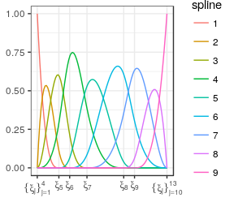<!-- -->
  </div>
  <div style="display: table-cell; vertical-align: top;">
  
  </div>
  <div style="display: table-cell; vertical-align: top;">

```r
grid.arrange(plot(eg_cp, show_spline = TRUE, show_cp = FALSE),
             plot(eg_cp),
             plot(eg_cp, show_spline = TRUE),
             nrow = 1)
```

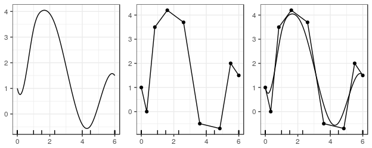<!-- -->
  </div>
  </div>
</div>

## Control Polygon Reduction (CPR)
- General Idea
    - Assume that $f\left(x\right)$ can be adequately modeled by $\bs{B}_{k, \bs{\xi}} \left( x \right) \bs{\theta}_{\bs{\xi}}$.
    - Start search for $\bs{\xi}$ within a larger sequence $\bs{\xi} \cup \bs{\xi}'.$

<br>

- CPR is a backward-step model selection process.
- Remove the least influential knot at each step.

<br>

- Metric for knot influence based changes in the control polygon.
- Sum of the squared distance between control vertex ordinates.
- More details in vignette and arxiv paper:
  https://arxiv.org/abs/1705.04756


## Assessing the Influence of a Knot

<div style="width: 100%; display: table;">
  <div style="display: table-row">
  <div style="width: 600px; display: table-cell; vertical-align: top;">
- Add elements to the knot sequence without affecting the spline function (Boehm 1980).

- Specifically, for $\bs{\xi} \text{ and } \bs{\xi} \cup \xi',$

$$\bs{B}_{k, \bs{\xi}}\left(x \right) \bs{\theta}_{\bs{\xi}} = \bs{B}_{k, \bs{\xi} \cup \xi'}\left(x \right) \bs{\theta}_{\bs{\xi} \cup \xi'}$$

- The relationship between $\bs{\theta}_{\bs{\xi}\cup\xi'}$ and $\bs{\theta}_{\bs{\xi}}$ is defined by a lower bi-diagonal matrix
$$\bs{\theta}_{\bs{\xi}\cup\xi'} = \bs{W}_{k, \bs{\xi}} \left( \xi' \right) \bs{\theta}_{\bs{\xi}}$$

  </div>
  <div style="display: table-cell; vertical-align: top;">
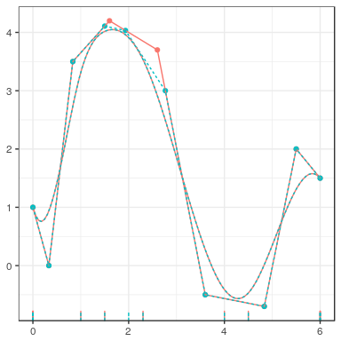<!-- -->
  </div>
  </div>
</div>


```r
bmat_boehm  <- update_bsplines(bmat, iknots = sort(c(attr(bmat, "iknots"), 2.0)))
theta_boehm <- insertion_matrix(2.0, attr(bmat, "xi")) %*% theta
plot(cp(bmat, theta), cp(bmat_boehm, theta_boehm), show_spline = TRUE, color = TRUE) +
  theme(legend.position = "none")
```

## Influence Weight, $w_j$, of $\xi_j \in \bs{\xi}$ on $\bs{B}_{k, \bs{\xi}}\left(x\right) \bs{\theta}_{\bs{\xi}}$

<script>
  function check_value(fieldvalue) {
    switch (fieldvalue) {
      case 1:
        document.getElementById("imagedest").innerHTML = "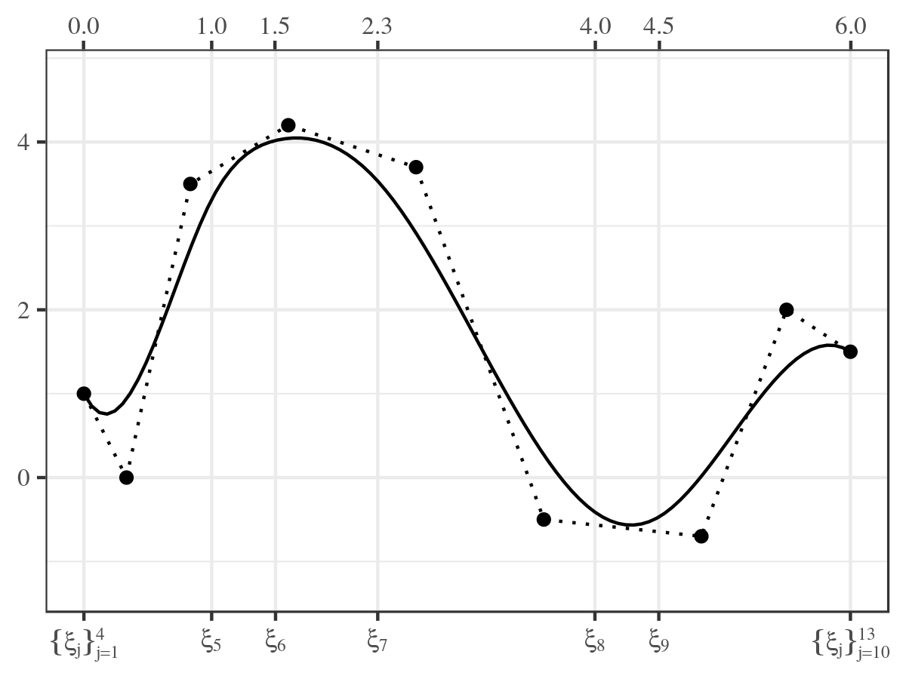";
        break;
      case 2:
        document.getElementById("imagedest").innerHTML = "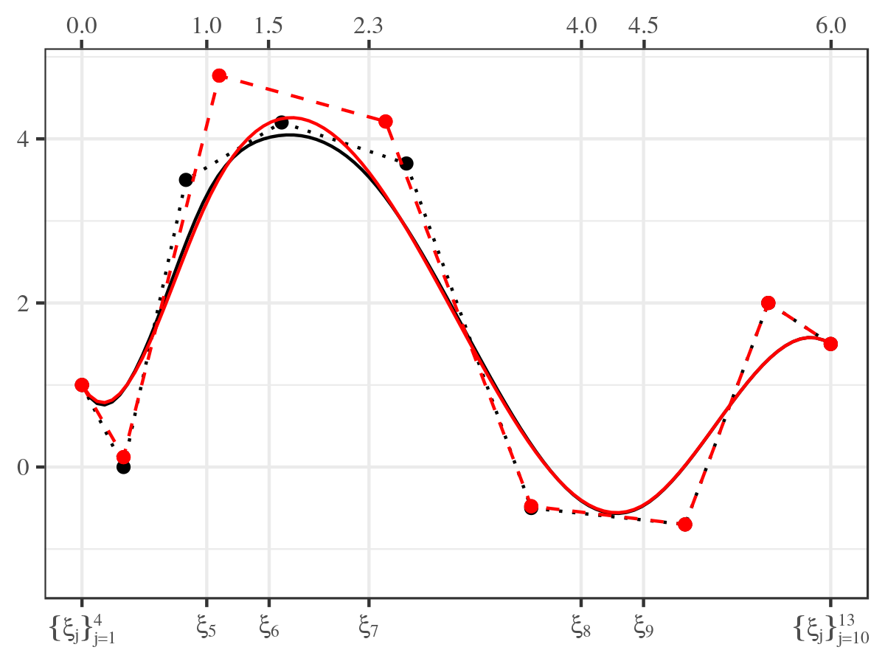";
        break;
      case 3:
        document.getElementById("imagedest").innerHTML = "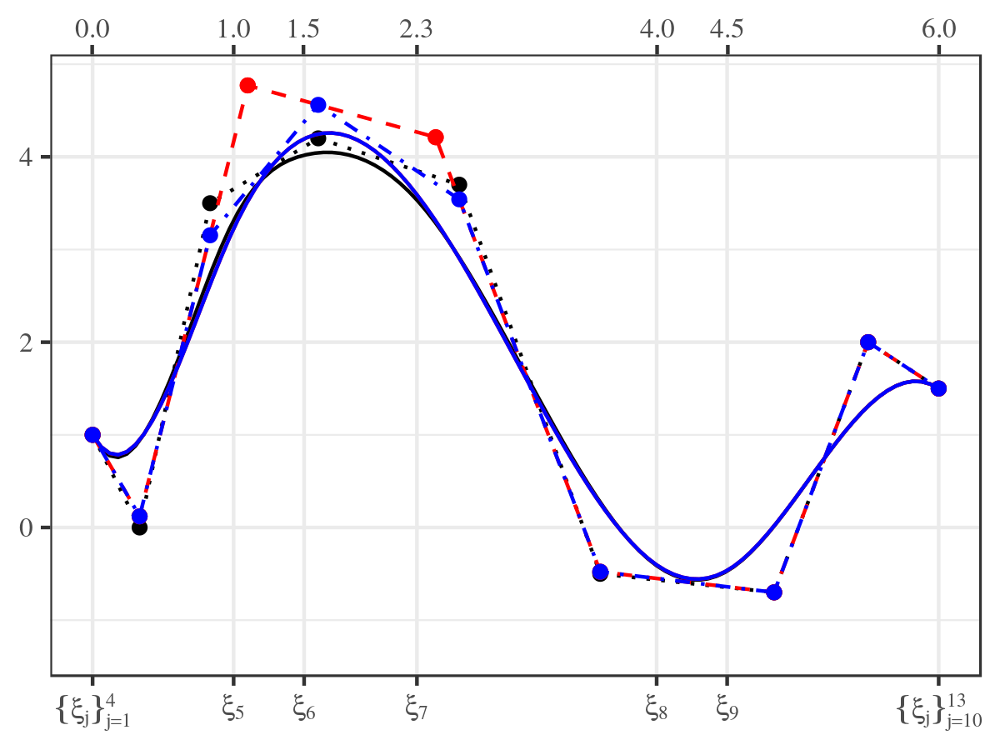";
        break;
      case 4:
        document.getElementById("imagedest").innerHTML = "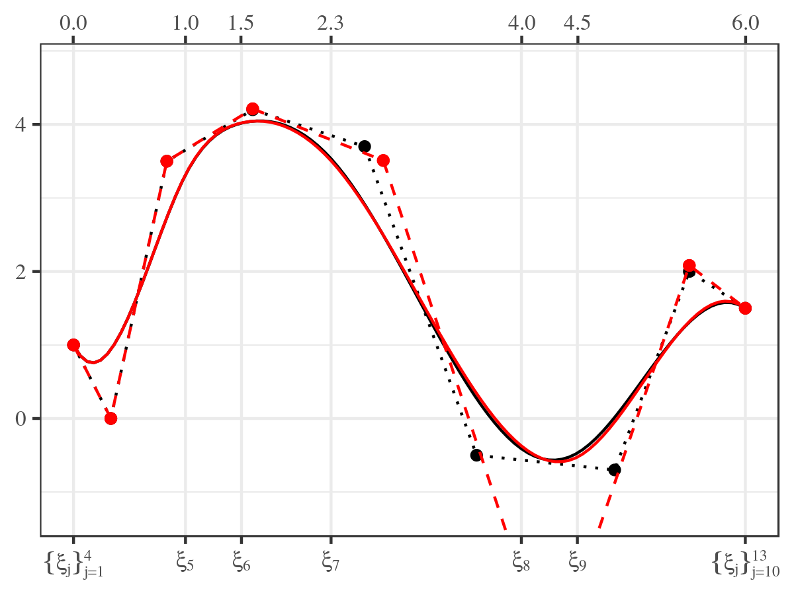";
        break;
      case 5:
        document.getElementById("imagedest").innerHTML = "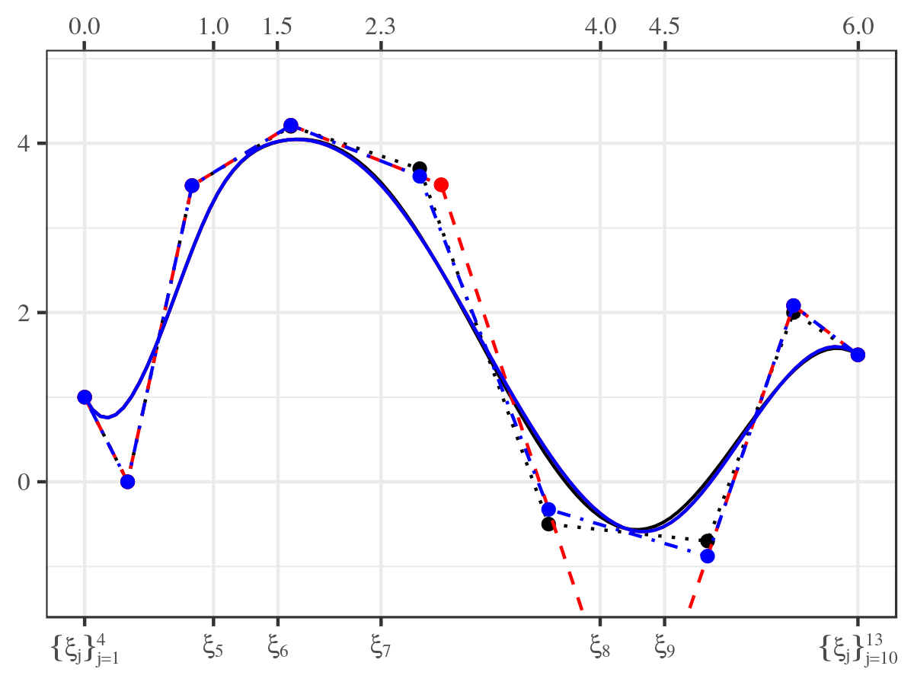";
        break;
      default:
        document.getElementById("imagedest").innerHTML = "";
    }
  }
</script>

<form name="builder">
<table cellpadding=10>
<tr>
  <td width=200px> Original CP &nbsp; &nbsp; </td>
  <td width=350px> Influence of $\xi_6$ </td>
  <td width=350px> Influence of $\xi_8$ </td>
</tr>
<tr>
  <td> <input type="radio" name="field" value=1 onclick='check_value(1)' checked="checked"/> $CP_{k, \bs{\xi}, \bs{\theta}_{\bs{\xi}}}$ </td>
  <td> <input type="radio" name="field" value=2 onclick='check_value(2)' /> $CP_{k, \bs{\xi}\backslash \xi_6, \bs{\theta}_{\bs{\xi}\backslash \xi_6}}$ </td>
  <td> <input type="radio" name="field" value=4 onclick='check_value(4)' /> $CP_{k, \bs{\xi}\backslash \xi_8, \bs{\theta}_{\bs{\xi}\backslash \xi_8}}$ </td>
</tr>
<tr>
  <td> </td>
  <td> <input type="radio" name="field" value=3 onclick='check_value(3)' /> $CP_{k, \left(\bs{\xi}\backslash \xi_6\right) \cup \xi_6, \bs{\theta}_{\left(\bs{\xi}\backslash \xi_6\right) \cup \xi_6}}$ </td>
  <td> <input type="radio" name="field" value=5 onclick='check_value(5)' /> $CP_{k, \left(\bs{\xi}\backslash \xi_8\right) \cup \xi_8, \bs{\theta}_{\left(\bs{\xi}\backslash \xi_8\right) \cup \xi_8}}$ </td>
</tr>
</table>
</form>

<hr>

<div style="width: 100%; display: table;">
  <div style="display: table-row">
  <div id="imagedest" style="width: 600px; display: table-cell; vertical-align: top;">
  
  </div>
  <div id="influence" style="display: table-cell; vertical-align: top;">

<font size=4>

$$
\begin{split}
\bs{\theta}_{\bs{\xi}\backslash \xi_j} &= \left( \bs{W}^{T} \bs{W} \right)^{-1} \bs{W}^{T} \bs{\theta}_{\bs{\xi}} \\ \\
\bs{\theta}_{\left(\bs{\xi}\backslash \xi_j\right) \cup \xi_j} &= \bs{W} \bs{\theta}_{\bs{\xi}\backslash \xi_j} \\
&= \bs{W} \left( \bs{W}^{T} \bs{W} \right)^{-1} \bs{W}^{T} \bs{\theta}_{\bs{\xi}} \\ \\
w_{j} &= \left\lVert \bs{\theta}_{\bs{\xi}} - \bs{\theta}_{ \left(\bs{\xi} \backslash \xi_j \right) \cup \xi_j} \right\rVert_2 \\
      &= \left\lVert \left( \bs{I} - \bs{W} \left( \bs{W}^T \bs{W} \right)^{-1} \bs{W}^T\right) \bs{\theta}_{\bs{\xi}} \right\rVert_2.
\end{split}
$$

$w_{6} = 0.539, \quad w_{8} = 0.278$
</font>
  </div>
  </div>
</div>


<div style="position: absolute; right: 0px; bottom: 0px;">

</div>
<div class="notes">

```r
influence_of(eg_cp)
## # A tibble: 5 x 4
##   index iknots         w  rank
##   <int>  <dbl>     <dbl> <dbl>
## 1     5    1.0 1.2832037     5
## 2     6    1.5 0.5391356     2
## 3     7    2.3 0.5586146     3
## 4     8    4.0 0.2775425     1
## 5     9    4.5 0.6479795     4
```
</div>

## The Control Polygon Reduction Algorithm
1. Start with a high cardinal knot sequences, say $L = 50,$ and set $l = L$ to index models.
2. Use an appropriate regression modeling approach to estimate the control polygon ordinates.
3. Construct the control polygon for the current $\bs{\xi}_{l}$ and $\bs{\theta}_{\bs{\xi}_{l}}$ estimate.
4. Use $CP_{k, \bs{\xi}_{l}, \bs{\theta}_{\bs{\xi}_l}}$ and find the influence weight for all internal knots.
5. Coarsen the knot sequence by removing the knot with the smallest influence weight.
6. Refit the regression model using the coarsened knot sequence and index $l = l - 1.$
7. Repeat steps 3 through 6 until all
  internal knots have been removed, _i.e._, if $l \geq 0$ go to 3, else go to 8.
8. Select the preferable model by visual inspection of diagnostic graphics.

## Idealized CPR Example

<iframe src="fdat_cpr_run.html"></iframe>

<div style="position: absolute; right: 0px; bottom: 0px;">

</div>
<div class="notes">
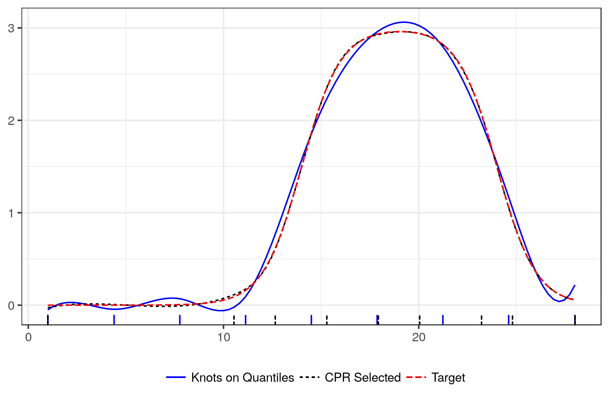
</div>

## Selected Simulation Results

<div style="width: 100%; display: table;">
  <div style="display: table-row">
  <div style="display: table-cell; vertical-align: top;">
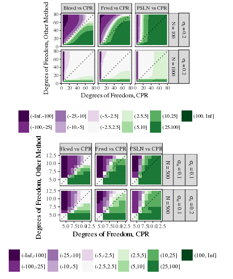<!-- -->
  </div>
  <div style="display: table-cell; vertical-align: top;">
  Median Time to Evaluate OLS
<table>
 <thead>
  <tr>
   <th style="text-align:left;"> method </th>
   <th style="text-align:right;"> Seconds </th>
  </tr>
 </thead>
<tbody>
  <tr>
   <td style="text-align:left;"> Bkwd </td>
   <td style="text-align:right;"> 33.5 </td>
  </tr>
  <tr>
   <td style="text-align:left;"> CPR </td>
   <td style="text-align:right;"> 5.5 </td>
  </tr>
  <tr>
   <td style="text-align:left;"> Frwd </td>
   <td style="text-align:right;"> 4.6 </td>
  </tr>
  <tr>
   <td style="text-align:left;"> PSLN </td>
   <td style="text-align:right;"> 3.9 </td>
  </tr>
</tbody>
</table>
<br>

  Median Time to Evaluate Mixed Effect Model
<table>
 <thead>
  <tr>
   <th style="text-align:left;"> method </th>
   <th style="text-align:right;"> Seconds </th>
  </tr>
 </thead>
<tbody>
  <tr>
   <td style="text-align:left;"> Bkwd </td>
   <td style="text-align:right;"> 3542.4 </td>
  </tr>
  <tr>
   <td style="text-align:left;"> CPR </td>
   <td style="text-align:right;"> 80.7 </td>
  </tr>
  <tr>
   <td style="text-align:left;"> Frwd </td>
   <td style="text-align:right;"> 80.5 </td>
  </tr>
  <tr>
   <td style="text-align:left;"> PSLN </td>
   <td style="text-align:right;"> 350.7 </td>
  </tr>
</tbody>
</table>
  </div>
  </div>
</div>

## Control Polygon Reduction | Conclusions

- CPR is capable of identifying high quality of fit, parsimonious B-spline regression models, quickly.

- Added bonuses of having a quick algorithm: Able to search over polynomial order.

- Knots, by being in "good" locations, might have meaningful interpretations.

- The CPR method generalizes to multi-variable B-splines via Control Net Reduction.


# cpr: An R Package
<aside class="gdbar">

</aside>

## cpr tools
The `cpr` package provides:

1. A simulated data set based on SWAN DHS
2. Tools for building and manipulating uni-variable and multi-variable B-splines.
3. Tools for building and manipulating control polygons and control nets
4. The `cpr` and `cnr` calls for running the control polygon reduction and
   control net reduction.
5. Lots of plotting and diagnostic tools.  
- Download
    - https://cran.r-project.org/package=cpr
    - https://github.com/dewittpe/cpr

## Overview | Data -- Initial Model -- CPR -- Selection of Preferable Model

```r
# Pseudo-code, Outline for CPR use
init_cp <- cp(y ~ bsplines(x), data = my_data_frame)  # initial control polygon
cpr_run <- cpr(init_cp)                               # run CPR
plot(cpr_run)                                         # plots to help you select a model
selected_cp <- cpr_run[[4]]                           # selected model
```

## Simulated Data Set

```r
str(spdg)
## Classes 'tbl_df', 'tbl' and 'data.frame':	24730 obs. of  9 variables:
##  $ id          : int  1 1 1 1 1 1 1 1 1 1 ...
##  $ age         : num  49.3 49.3 49.3 49.3 49.3 ...
##  $ ttm         : num  -5.19 -5.19 -5.19 -5.19 -5.19 ...
##  $ ethnicity   : Factor w/ 5 levels "Caucasian","Black",..: 4 4 4 4 4 4 4 4 4 4 ...
##  $ bmi         : num  36.2 36.2 36.2 36.2 36.2 ...
##  $ day_from_dlt: num  -8 -7 -6 -5 -4 -3 -2 -1 0 1 ...
##  $ day_of_cycle: int  1 2 3 4 5 6 7 8 9 10 ...
##  $ day         : num  -1 -0.875 -0.75 -0.625 -0.5 ...
##  $ pdg         : num  0.2401 0.0668 0.1088 0.0733 0.0979 ...
```

<div style="position: absolute; right: 0px; bottom: 0px;">

</div>
<div class="notes">
<!-- -->
</div>

## Build The Initial Control Polygon
<div style="width: 100%; display: table;">
  <div style="display: table-row">
  <div style="display: table-cell; vertical-align: top;">

```r
# Packages needed for the following examples
library(cpr)
library(dplyr)
library(lme4)

# initial control polygon, 4th order B-splines
init_cp4 <- cp(log10(pdg) ~ bsplines(day, df = 54) + (1 | id),
               data = spdg,
               method = lmer)
plot(init_cp4)
```
  </div>
  <div style="display: table-cell; vertical-align: top;">
  </div>
  <div style="display: table-cell; vertical-align: top;">
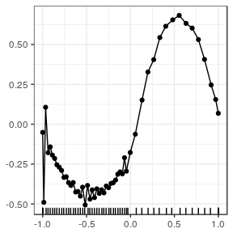<!-- -->
  </div>
  </div>
</div>

* *We will explore how the `method` argument works in more detail.*


## Run CPR

```r
cpr_run4 <- cpr(init_cp4)
```

* *We will explore how the `cpr` is able to fit all the models via updating the
  `formula` element of `init_cp4` object.*

## Select a Model
<div style="width: 100%; display: table;">
  <div style="display: table-row">
  <div style="display: table-cell; vertical-align: top;">

```r
plot(cpr_run4, color = TRUE)
```

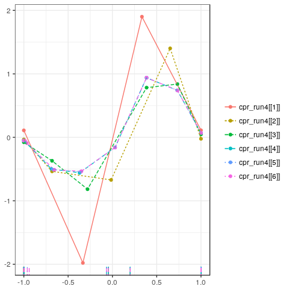<!-- -->
  </div>
  <div style="display: table-cell; vertical-align: top;">
  
  </div>
  <div style="display: table-cell; vertical-align: top;">

```r
plot(cpr_run4, type = "rmse", to = 12)
```

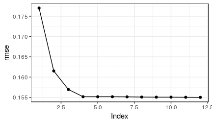<!-- -->

```r
cpr_run4
## A list of control polygons
## List of 51
##  - attr(*, "class")= chr [1:2] "cpr_cpr" "list"
selected_cp4 <- cpr_run4[[4]]
```
  </div>
  </div>
</div>


## Selected CP

```r
str(selected_cp4)
## List of 12
##  $ cp          :Classes 'tbl_df', 'tbl' and 'data.frame':	7 obs. of  2 variables:
##   ..$ xi_star: num [1:7] -1 -0.6889 -0.3703 0.0298 0.3854 ...
##   ..$ theta  : num [1:7] -0.0477 -0.4992 -0.5588 -0.1586 0.9388 ...
##  $ xi          : num [1:11] -1 -1 -1 -1 -0.0668 ...
##  $ iknots      : num [1:3] -0.0668 -0.0443 0.2006
##  $ bknots      : num [1:2] -1 1
##  $ order       : num 4
##  $ call        : language cp(formula = log10(pdg) ~ bsplines(day, iknots = c(-0.0667568176695966,      -0.0442920251104394, 0.2005767012687| __truncated__ ...
##  $ keep_fit    : logi FALSE
##  $ fit         : logi NA
##  $ loglik      : num 8523
##  $ rmse        : num 0.155
##  $ coefficients: num [1:7] -0.0477 -0.4992 -0.5588 -0.1586 0.9388 ...
##  $ vcov        : num [1:7, 1:7] 1.23e-04 8.09e-05 1.15e-04 1.01e-04 1.08e-04 ...
##  - attr(*, "class")= chr [1:2] "cpr_cp" "list"
```

## Methods for `cpr_cp` Objects

```r
methods(class = "cpr_cp")
##  [1] cpr               get_spline        influence_of     
##  [4] influence_weights plot              predict          
##  [7] print             summary           update_bsplines  
## [10] wiggle           
## see '?methods' for accessing help and source code
```

## Other Orders
CPR is fast, consider other polynomial orders to help find parsimonious models.

```r
init_cp3 <- update_bsplines(init_cp4, df = 53, order = 3)
init_cp2 <- update_bsplines(init_cp4, df = 52, order = 2)
cpr_run3 <- cpr(init_cp3)
cpr_run2 <- cpr(init_cp2)
```


```r
list(cpr_run4, cpr_run3, cpr_run2) %>%
lapply(summary) %>%
bind_rows(.id = "order") %>%
mutate(order = factor(order, 1:3, c("4th", "3rd", "2nd"))) %>%
filter(index < 13) %>%

ggplot() +
aes(x = dfs, y = rmse, color = order, linetype = order) +
geom_path() +
geom_point()   # Graphic on the next slide
```

## Summaries
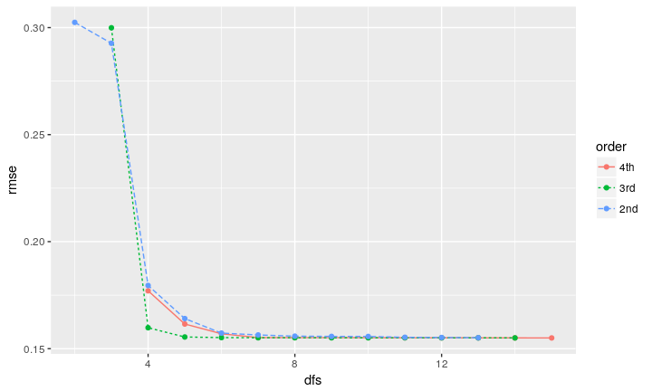<!-- -->


```r
# Preferable Model  (index and dfs are not the same thing)
cpr_run3[[3]]
```
## Control Net Reduction

* Control Net Reduction (CNR) is the natural extension of CPR from uni-variable
  B-splines to multi-variable B-splines.


```r
# Pseudo-code example of CNR
init_cn <- cn(y ~ btensor(list(x1, x2, x3)))   # Initial control net
cnr_run <- cnr(init_cn)                        # run CNR
plot(cnr_run)                                  # diagnostic plots
selected_cn <- cnr_run[[3]]                    # select preferable model
```

## Some Results from My Dissertation
<iframe src="swan_rgl.html"></iframe>

## Some Results from My Dissertation
<iframe src="swan_animation_age_ttm.html"></iframe>

## Download cpr

- `cpr`: Control Polygon Reduction 
    - https://cran.r-project.org/package=cpr
    - https://github.com/dewittpe/cpr

- Detailed examples are in vignette and standard documentation files.

- Or the paper on arXiv: https://arxiv.org/abs/1705.04756

- Please test the package.  File bug reports at
  https://github.com/dewittpe/cpr/issues

- These slides and the following examples are available at
  https://github.com/dewittpe/cpr-DRUG-june-2017
